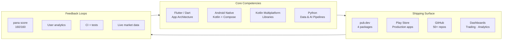

<div align="center">

# Govind Tank
### Mobile Architect · Flutter / Android / Compose Multiplatform · On-Device AI

**Architect cum Developer** — design systems, ship packages, automate the boring.

[](https://www.linkedin.com/in/govindtank/)
[](mailto:govindtank600@gmail.com)
[](https://twitter.com/govindtank4)

```
$ govindtank --help

Usage: developer [options]

  --stack        Flutter · Dart · Android · Kotlin Multiplatform · Python · TypeScript
  --architecture Mobile-first systems · on-device generative AI · real-time data pipelines
  --ship         50+ repos · 4 pub.dev packages · Play Store apps · 3 live dashboards
  --philosophy   Proof over claims. Architecture over framework. Automation over repetition.
  --consult      Mobile architecture · on-device AI · trading & analytics dashboards
  --contact      govindtank600@gmail.com · linkedin.com/in/govindtank

Examples:
  $ govindtank --hire
  → Yes. Details below.
```

</div>

---

## 📄 RFC — Profile of Govind Tank

> **Status:** ACTIVE · **Owner:** @govindtank · **Version:** 2026.08
> **Scope:** Mobile architecture, developer tooling, data & AI pipelines

### Context

Senior mobile developer shipping production software across **Flutter, Android native, and Kotlin Multiplatform** — while running real-time data systems (NSE stock scanning, paper trading) and on-device AI (whisper.cpp, image generation) as side infrastructure. Product owner of a **6-package mobile library portfolio** and a published Play Store app.

### Constraints

| # | Constraint | How it shapes the work |
|---|-----------|----------------------|
| 1 | On-device > cloud | Privacy, latency, zero API bills. AI and ML run where the user is. |
| 2 | Pure Dart / pure Kotlin when possible | No native dependency chains when a few hundred lines of Dart does it. |
| 3 | Automation over manual ops | If a task repeats, a cron job owns it — not my memory. |
| 4 | Production quality on day one | pana 160/160, tests green, docs complete. No "works on my machine". |
| 5 | Proof over claims | Every skill on this page has a shipped artifact behind it. |

### Architecture



### Case Studies

**1. `country_mobile_validator` — input validation, done properly**

- **Problem:** `country_code_picker` v2 was broken on Flutter master; phone validation across countries was guesswork (fake length ranges, no mobile/landline distinction).
- **Solution:** Pure Dart validator with **refreshable libphonenumber metadata**, real per-country length ranges (8–10, 10–11 digits), mobile-only type detection, and a picker-friendly API (`validateForCountry` + `isMobileLength`).
- **Result:** `v0.2.0` published, **pana 160/160**, all tests green. One dependency, zero platform channels.

**2. `flutter_whisper` — on-device speech-to-text**

- **Problem:** Transcription required cloud APIs — private, slow, and metered.
- **Solution:** Native whisper.cpp bridge with automatic model download, streaming results, off-main-thread transcription, real cancellation, and mic recording (AudioRecord → WAV).
- **Result:** `v0.1.0` — private, offline, and free per user. iOS + Android.

**3. Real-time NSE trading dashboards**

- **Problem:** Darvas-box breakout scanning and paper trading were manual, error-prone, and not time-bound.
- **Solution:** Python scanner + options paper-trading bot (Short Put Credit Spread, ₹1L virtual capital) with **4 daily cron jobs**, Telegram alert delivery, and a live dashboard.
- **Result:** Real-time alerts on schedule, position tracking with trailing stops, hourly price refresh automation.

### Trade-offs

- **Refreshable metadata over bundled data** in `country_mobile_validator` — costs first-load latency, wins zero native deps and always-current country rules. Future: metadata cache layer.
- **Native bridge over pure-Dart in `flutter_whisper`** — whisper.cpp is the only serious on-device ASR; the bridge keeps the Dart surface clean.
- **Python over TypeScript for trading systems** — pandas/yfinance ecosystem wins for data; UI stays web-first.

### Metrics

| Metric | Value |
|--------|-------|
| Repositories shipped | **50+** |
| pub.dev packages | **4** (library portfolio: **6** in progress) |
| Best pana score | **160/160** |
| Play Store production apps | **2** |
| Automated cron jobs (trading) | **4** daily |
| Languages in production | **6** |

---

## 📦 pub.dev Scoreboard

| Package | Version | What it does |
|---------|---------|--------------|
| [`country_mobile_validator`](https://pub.dev/packages/country_mobile_validator) | 0.2.0 | Per-country mobile validation, refreshable metadata, **pana 160/160** |
| [`waveform_pro`](https://pub.dev/packages/waveform_pro) | 1.0.0 | GPU-accelerated waveform widget — zoom, regions, markers, peak extraction |
| [`flutter_whisper`](https://pub.dev/packages/flutter_whisper) | 0.1.0 | On-device speech-to-text via whisper.cpp |
| [`quote_painter`](https://pub.dev/packages/quote_painter) | 0.1.0 | Styled text on image/video canvas — gradient, stroke, shadow |

## 🗺️ Repo Blueprint

| Domain | Repos |
|--------|-------|
| **Flutter packages** | [`country_mobile_validator`](https://github.com/govindtank/country_mobile_validator) · [`waveform_pro`](https://github.com/govindtank/waveform_pro) · [`flutter_whisper`](https://github.com/govindtank/flutter_whisper) · [`quote_painter`](https://github.com/govindtank/quote_painter) |
| **Compose Multiplatform libs** | [`cmp-keyboard`](https://github.com/govindtank/cmp-keyboard) · [`cmp-linked-text`](https://github.com/govindtank/cmp-linked-text) · [`cmp-clipboard`](https://github.com/govindtank/cmp-clipboard) |
| **Apps & games** | [`portfolioApp`](https://github.com/govindtank/portfolioApp) *(Play Store)* · [`AI-Content-Factory-`](https://github.com/govindtank/AI-Content-Factory-) · [`faceattend`](https://github.com/govindtank/faceattend) *(+ mobile, admin)* · [`habithive`](https://github.com/govindtank/habithive) · [`mindful-time-moments`](https://github.com/govindtank/mindful-time-moments) · [`bitverse`](https://github.com/govindtank/bitverse) · [`music-app`](https://github.com/govindtank/music-app) · [`weather-glass`](https://github.com/govindtank/weather-glass) · [`dharmyudh_game`](https://github.com/govindtank/dharmyudh_game) |
| **Live wallpapers** | [`DepthWallTank`](https://github.com/govindtank/DepthWallTank) · [`depth-live-wallpaper-android`](https://github.com/govindtank/depth-live-wallpaper-android) · [`depth_clock`](https://github.com/govindtank/depth_clock) · [`livewally`](https://github.com/govindtank/livewally) |
| **Data & AI (Python)** | [`stock-scanner`](https://github.com/govindtank/stock-scanner) · [`autovid`](https://github.com/govindtank/autovid) · [`ai-content-generator`](https://github.com/govindtank/ai-content-generator) · [`ai-sdlc-orchestrator`](https://github.com/govindtank/ai-sdlc-orchestrator) · [`MiniECommerceApis`](https://github.com/govindtank/MiniECommerceApis) |
| **Web & portfolio** | [`govindtank.github.io`](https://github.com/govindtank/govindtank.github.io) · [`portfolio`](https://github.com/govindtank/portfolio) · [`Box-Breakout-Tracker`](https://github.com/govindtank/Box-Breakout-Tracker) |

## 📜 Ship Log

> Recent shipments. The log grows itself — automation appends a line per release.

- **2026-08-06** — `country_mobile_validator` **v0.2.0** — format pass, pana **160/160**, all tests green
- **2026-07-31** — `flutter_whisper` Round 2 — off-main-thread transcription, native progress, real cancel, mic recording, language select, share, history
- **2026-07-30** — `waveform_pro` **v1.0.0** — production docs: code examples, controller usage, regions/markers, API reference tables
- **2026-07-30** — `quote_painter` — screenshot + README refresh
- **2026-06-19** — `stock-scanner` — hourly price refresh automation live
- **earlier** — `portfolioApp` published on **Play Store**

---

<div align="center">

**Ship something today. Architecture first, proof second, noise never.**

[View full repo index](https://github.com/govindtank?tab=repositories) · [Portfolio site](https://govindtank.github.io)

<sub>README rendered as an RFC because architecture is a habit, not a slide deck.</sub>

</div>
