<div align="center">


<br/>

> **Engineer's mindset** — I don't build apps, I build systems that build apps. Every library below ships to production, scores 160/160 on pub.dev, and outlives whatever I used it for.

</div>

---

## Shipped Libraries



### Try them — real APIs, no magic

```dart
// 1. Validate a mobile number against a country's real numbering plan
final valid = validateForCountry("IN", "98765 43210") && isMobileLength("IN", 10);

// 2. Stream speech-to-text fully offline (whisper.cpp under the hood)
final stream = WhisperStream.start(audioBytes);
stream.listen(onPartialTranscript, onCancel);

// 3. GPU-rasterized audio waveforms at 60fps with zoom + peak markers
WaveformView(painter: GpuPainter(), controller: ctrl)..ctrl.zoomTo(60fps, region);

// 4. Render gradient, stroked, shadowed quote images straight to canvas
QuoteCanvas.render("Code is poetry").withGradient().withShadow().exportPng();
```

---

## Automation Status

<div style="display:flex; gap:20px; justify-content:center; margin-top:24px; flex-wrap:wrap;">
  <div style="background:#161b22; border:1px solid #30363d; border-radius:12px; padding:16px; text-align:center; min-width:150px;">
    <strong style="display:block; margin-bottom:8px;">📊 stock-scanner</strong>
    <span style="color:#27c93f; font-size:14px;">● 4× daily IST</span>
    <span style="color:#8b949e; font-size:12px; margin-top:6px;">Telegram delivery</span>
  </div>
  <div style="background:#161b22; border:1px solid #30363d; border-radius:12px; padding:16px; text-align:center; min-width:150px;">
    <strong style="display:block; margin-bottom:8px;">🔁 readme-refresh</strong>
    <span style="color:#27c93f; font-size:14px;">● 4× daily</span>
    <span style="color:#8b949e; font-size:12px; margin-top:6px;">Activity feed</span>
  </div>
  <div style="background:#161b22; border:1px solid #30363d; border-radius:12px; padding:16px; text-align:center; min-width:150px;">
    <strong style="display:block; margin-bottom:8px;">🔬 pub.dev checker</strong>
    <span style="color:#27c93f; font-size:14px;">● nightly</span>
    <span style="color:#8b949e; font-size:12px; margin-top:6px;">Score optimization</span>
  </div>
</div>

---

## Contribution Snake


---

## Recent Activity

<!-- ACTIVITY:START -->
<!-- ACTIVITY:END -->

*Last updated: <!--UPDATED-->*

---

<div style="margin-top:32px; text-align:center;">
<a href="https://github.com/govindtank" style="display:inline-block; background:#238636; color:#ffffff; padding:10px 24px; border-radius:6px; text-decoration:none; font-weight:600; margin:8px;">View Repositories</a>
<a href="https://pub.dev/publishers/pub.dartlang.org/author/govindtank" style="display:inline-block; background:#3b82f6; color:#ffffff; padding:10px 24px; border-radius:6px; text-decoration:none; font-weight:600; margin:8px;">Packages</a>
<a href="https://govindtank.github.io/" style="display:inline-block; background:#161b22; color:#c9d1d9; border:1px solid #30363d; padding:10px 24px; border-radius:6px; text-decoration:none; font-weight:600; margin:8px;">Portfolio</a>
</div>

</div>
