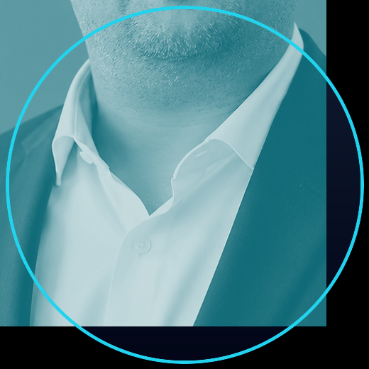

# Govind Tank

**Mobile Architect · Developer · Technical Consultant**  
Design systems • Ship packages • Automate production workflows

  🚀 Flutter · Android
  🐍 Python · On-device AI
  📦 50+ repos
  📱 2 Play Store apps

---

## Live Library Demos

<svg src="assets/library-demo.svg" style="max-width:700px; height:auto; display:block; background:#161b22; padding:24px; border-radius:12px; box-shadow:0 8px 32px rgba(0,0,0,0.3);"/>

---

## Active Packages

  <strong style="color:#58a6ff; display:block; margin-bottom:8px;">Production Libraries</strong>
  <table style="width:100%; text-align:left;">
    <tr>
      <td style="color:#c9d1d9; font-weight:600;">country_mobile_validator</td>
      <td style="color:#8b949e; font-size:13px;">v0.2.0 · pana 160/160</td>
    </tr>
    <tr><td colspan="2" style="border-top:1px solid #21262d;"></td></tr>
    <tr>
      <td style="color:#c9d1d9; font-weight:600;">flutter_whisper</td>
      <td style="color:#8b949e; font-size:13px;">v0.1.0 · whisper.cpp bridge</td>
    </tr>
    <tr><td colspan="2" style="border-top:1px solid #21262d;"></td></tr>
    <tr>
      <td style="color:#c9d1d9; font-weight:600;">waveform_pro</td>
      <td style="color:#8b949e; font-size:13px;">v1.0.0 · GPU shader rasterizer</td>
    </tr>
    <tr><td colspan="2" style="border-top:1px solid #21262d;"></td></tr>
    <tr>
      <td style="color:#c9d1d9; font-weight:600;">quote_painter</td>
      <td style="color:#8b949e; font-size:13px;">v0.1.0 · text-on-canvas engine</td>
    </tr>
  </table>

---

## Automation Status

  

    <strong style="display:block; margin-bottom:8px;">📊 stock-scanner</strong>
    ● 4× daily IST
    Telegram delivery
  

  

    <strong style="display:block; margin-bottom:8px;">🔁 readme-refresh</strong>
    ● 4× daily
    Activity feed
  

  

    <strong style="display:block; margin-bottom:8px;">🔬 pub.dev checker</strong>
    ● nightly
    Score optimization
  

---

<a href="https://github.com/govindtank" style="display:inline-block; background:#238636; color:#ffffff; padding:10px 24px; border-radius:6px; text-decoration:none; font-weight:600; margin:8px;">View Repositories</a>  
<a href="https://pub.dev/publishers/pub.dartlang.org/author/govindtank" style="display:inline-block; background:#3b82f6; color:#ffffff; padding:10px 24px; border-radius:6px; text-decoration:none; font-weight:600; margin:8px;">Packages</a>

