 

> **Engineer's mindset** — I don't build apps, I build systems that build apps. Every library below ships to production, scores 160/160 on pub.dev, and outlives whatever I used it for.

---

## Contribution Graph

---

## Recent Activity

<!-- ACTIVITY:START -->
- `2026-08-14` **govindtank.github.io** — fix: remove duplicate frontmatter block from agentic AI blog
- `2026-08-14` **govindtank.github.io** — fix: normalize blog frontmatter, dates, covers, and remove duplicate t
- `2026-08-14` **govindtank.github.io** — fix: rewrite off-topic blog posts and fix TOC scroll highlighting
- `2026-08-14` **govindtank.github.io** — fix: make blog cron fast-by-default with LLM health check
- `2026-08-14` **govindtank.github.io** — blog: fallback post 2026-08-14
<!-- ACTIVITY:END -->

*Last updated: 2026-08-07 19:04 UTC*

---

<a href="https://github.com/govindtank" style="display:inline-block; background:#238636; color:#ffffff; padding:10px 24px; border-radius:6px; text-decoration:none; font-weight:600; margin:8px;">View Repositories</a>
<a href="https://pub.dev/publishers/pub.dartlang.org/author/govindtank" style="display:inline-block; background:#3b82f6; color:#ffffff; padding:10px 24px; border-radius:6px; text-decoration:none; font-weight:600; margin:8px;">Packages</a>
<a href="https://govindtank.github.io/" style="display:inline-block; background:#161b22; color:#c9d1d9; border:1px solid #30363d; padding:10px 24px; border-radius:6px; text-decoration:none; font-weight:600; margin:8px;">Portfolio</a>

